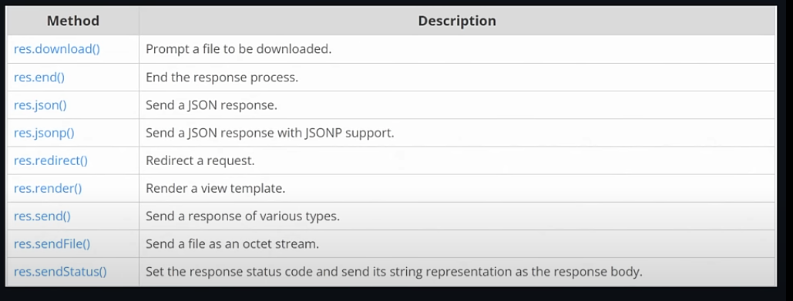

- 
---
# ===PART 1== : Understanding GET, POST, PUT Request

```
Root
│
├── public/
│   └── mypage.html
|
├── main.js
└── README.md
```

---
#### Get Request 

```
const express = require('express')
const app = express()
const port = 3000

app.get('/', (req, res) => {
  console.log("It is a get request")
  res.send('Hello World!')
})

app.listen(port, () => {
  console.log(`Example app listening on port ${port}`)
})
```
## Post Request : NGP

1. Create a public folder 
2. inside it mypage.html with a function, let file name be x1a
3. 
```
   <script>
       async function testPost(){
            let a = await fetch("/", {method: "POST"})
            let b = await a.text()
            console.log(b);
       }
       testPost()
    </script>
```
4. 
```
app.use(express.static("public"))

const express = require('express')
const app = express()
const port = 3000

app.get('/', (req, res) => {
  console.log("It is a get request")
  res.send('Hello World!')
})

app.post('/', (req, res) => {
  console.log("Hello post");
  res.send('Hello, I am post req')
})

app.listen(port, () => {
  console.log(`Example app listening on port ${port}`)
})
```

5.  Run on localhost:3000/mypage.html            file name

#### PUT Request 

1. Repeat Every steps of post request
2. `{method: "PUT"}`
3.  
```
app.put('/', (req, res) => { 
  console.log("Hello PUT");
  res.send('Hello, I am PUT req')
})
```

4. Run on localhost:3000/mypage.html 
---

## Chaining of Request

- adding next to earlier last, works same, different look

```
app.get('/', (req, res) => {
  console.log("It is a get request")
  res.send('Hello World!')
}).post('/', (req, res) => {
  console.log("Hello post");
  res.send('Hello, I am post req')
}).put('/', (req, res) => {
  console.log("Hello put");
  res.send('Hello, I am put req')
})

```

---
# ===PART 2== : Serving HTML file

```
Root
│
├── templates/
│   └── index.html
|
├── main.js
└── README.md
```

---
## ` res.json`

- `sendFile()`  is used to send file
- `res.send()` is used to send text
- `{root: __dirname}` is used to specify root to from `templates/index.html` else error

```
app.get("/index",(req, res) => {              
  console.log("INDEX: I Am");
  // res.send('Hello, I am index')         //for some line
  res.sendFile('templates/index.html', {root: __dirname}) 
})

//Go to /index
```

---
## Response Methods



---
## `res.json`

```
app.get("/api",(req, res) => {              
  res.json({a:1, b:2, c:3})
})

//Go to /api
```

---
# ===PART 3== : Postman

- Download : Postman [click me](https://www.postman.com/downloads/)
- Use : to create api, request easily.

- Steps To initialize and test a api
	1. Create a workshop
	2. Blank Workspace
	3. Select Team
	4. Go to Workspace
	5. New 
	6. Http
	7. Go to main.js and run a server 
	8. Enter http://http://localhost:3000/ + GET Request + Send
	9. Outputs: `res.send("Hello World!")  => Hello 
	10. Save

- Create a Collection
	1. Save as
	2. Name "Home"
	3. Save
	4. Now able to change name "get Home"
	5. Duplicate and rename as "post home"
	6. Change post home `GET` -> `POST` + Send
	7. Outputs: `Hello World! post`

- testing different api request
	1. Duplicate "post home" 
	2. Rename to "api home"
	3. Enter http://http://localhost:3000/api + GET Request + Send
	4. Output --> json : `{a:1, b:3, name:["meme", "King"]}`
	

- Share
	1.  Go to Collection
	2. Three dot
	3. export
---

# ===PART 4== : Express Router

- Use: helps to organize api & another way to request them
- Aim: 
	1. instead of writing all at one place
	2. we divide it in sections for easy management, etc

```
Root
│
├── routes/
│   └── blog.js
│   └── shop.js
|
├── main.js
└── README.md
```

1. main.js

```
const blogs = require('./routes/blogs')
const shops = require('./routes/shops')
```

2. routes/blog.js

	- app request under this routes will specifically includes blogs api.

2. routes/shop.js

	- similarly blog.js

3. Example: Above file structure shows perfect example
---