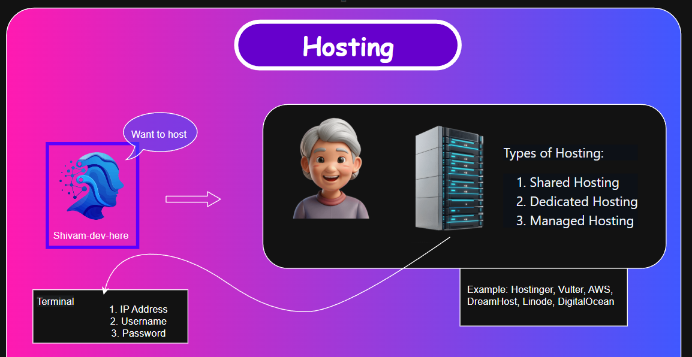

Description

---



---
## Terminal

1. Open terminal
2. `ssh root@{ip address}`
3. Enter Password

- Now we are in the terminal of server

---
## FileZilla 

- install [Download](https://filezilla-project.org/)
- Insert
- Port: 22?  ∵ To transfer file via SFTP
- Click Yes


---
## Inserting a Node.js App

### Filezilla

1. Click on '/'  → dbl clk at Home folder
2. Create Directory `nodejsapp`

### Offline Folder

```
Root
└─ src/
    ├── controllers/
    ├── models/
    ├── routes/
    ├── views/
    └── index.js
```

- index.js
```
npm init -y
npm i express@4
```

- Select `src/`   `package.json`     `package-lock.json`
- Paste at `nodejsapp` Directory on Filezilla

---
## Dotenv

- Inserting critical information here and access them in directory without actual showcase  

- Install `npm i dotenv`
- Create

```
Root
 ├─── .env
 └─── index.js
```

- `.env`     => `PASSWORD=Shivam`

- `index.js`   =>   

```
const express = require('express')

require('dotenv').config()

const app = express()
const port = 3000

console.log(preocess.env)      // Provides ......
console.log(preocess.env.PASSWORD)      // Provides 'PASSWORD' > NGP this Line
```

---
## Hosting a Website

```
Root
 └─── index.html
```

- `index.html`: Add some CSS
#### Terminal

- apache: used
- NGINX: better

```
apt install apache2
y
{space} 
Enter
cd /var/WWW
ls
cd html/
```

#### Filezilla

- Remote site: `/var/WWW/html`  + Enter
- Paste `index.html`
- Overwrite + ok

### Output

- Browser
- URL: {IP Address}   =>    `index.html`

---

- [x] Watch Linux Videos

---
